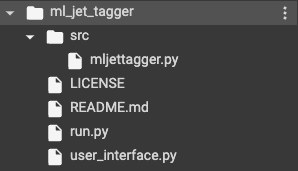
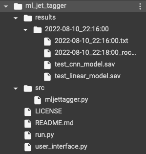

<p align="center">
 
</p>

<h3 align="center">Machine Learning Jet Tagger - High Energy Physics</h3>

<div align="center">


[](/LICENSE)

</div>

---

a tool for developing and testing machine learning models performing binary classification on monochromatic image set

## About <a name = "about"></a>

This tool was made in a summer internship project at University College London Department of Physics and Astronomy, aiming at building a machine learning algorithm to efficiently recognise electron pair production signals from their background jet noises in the ATLAS experiment.

Undergraduate students with limited experience on command-line interface (CLI) might find this tool particularly useful, as only editing text and running Python scripts are required. GUI development on university computing cluster can be then achieved by using the SSH feature in modern IDEs.

## Getting Started <a name = "getting_started"></a>

It is more ideal to train machine learning network on GPU, which is widely availabe at university computing cluster. To test if you can run Python codes on GPU, one can use a TensorFlow(tf) method:

```
print("Num GPUs Available: ", len(tf.config.list_physical_devices('GPU')))
```

If there is available GPU for TensorFlow to pick up, it will print out an non-zero output, such as:

```
Num GPUs Available: 1
```

### Prerequisites

This package was developed and tested on `Python 3.7.13` and included the following special packages and modules, other than the popular ones such as numpy, matplotlib and pandas: 

- tensorflow==2.8.2
- keras==2.8.0
- scikit-learn==1.0.2

### Installing

This tool is portable under unix-like environment. To install, simply download the repository by runing the code below in the terminal:


```
git clone https://github.com/zianonlyhk/ml_jet_tagger.git
```

And change to the directory:

```
cd ml_jet_tagger
```

All of the outputs of the code will be stored under the `ml_jet_tagger` directory, making the codes very portable. Users can move the folder to a suitable address without worrying any path issue.

## Usage <a name = "usage"></a>

To use this code, users **must** first edit the `user_interface.py` file to specify the directory storing all of the input image set. There can be potential error with users working under Windows operating system as a different slash is used in defining address. It is advised to test this code on a cloud machine with GPU capability such as Google Colab.

### Editting the "user_interface.py" file

Users might use a more friendly and modern terminal text editor, `nano` to work on the interface configuration file:

```
nano ./user_interface.py
```

Press `Control + S` to save and `Control + X` to exit the programme after editting.

### Preparing raw data for training

Users should prepare 2 files, input data `X` and its label `y`, in ".npy" format that specifies they are Numpy array instances. These 2 files should be put under the same directory `DATA_DIR` and the directory must be specified in "user_interface.py".

The 2 Numpy arrays must satisfy:
1. `len(X) = len(y)`
2. Every entry in `X` must share the same dimension and array structure with any other member
3. If the input data consists of images, `X.shape()` must yield: `(len(X), y_resolution, x_resolution, 1)` if the images are monochromatic or `(len(X), y_resolution, x_resolution, 3)` if they are images with RGB colour.
4. The 1D array `y` consists of only `1`, which specify signal, and `0` which specify background.

### Running the code

A seperated `run.py` file was used to achieve automatic log file generation. There is no need for the user to keep track of which log file corresponding to which run instance. No understanding of `touch` and writing to, `>>`, is required. Simply run:

```
python ./run.py
```
or
```
python3 ./run.py
```
and all of the results will be located under the `./results/` directory in the same folder as run.py and user_interface.py

## Example Results <a name = "results"></a>

Before running the code, just being cloned from git:
<p align="center">
</p>

After defining an image directory and running with no error:

<p align="center">
</p>

## Authors <a name = "authors"></a>

- Zian Huang [@zianonlyhk](https://github.com/zianonlyhk) - putting everything together, making the project codes transferable for students in the future to have a look

## Acknowledgements <a name = "acknowledgement"></a>

- The author would express his great thanks to his teammates on the physics project: Mr. Ibrahim Almasri and Mr. Wei Sheng Lai, for providing the foundation of the plotting funtion
- The physics project behind this was supervised by Prof. Nikolaos Konstantinidis at UCL Department of Physics and Astronomy
- We also really appreciate all of the supports from Dr. Naoki Kimura and Dr. Alex Christopher Martyniuk at CERN
